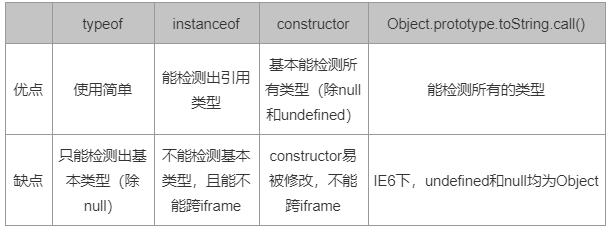
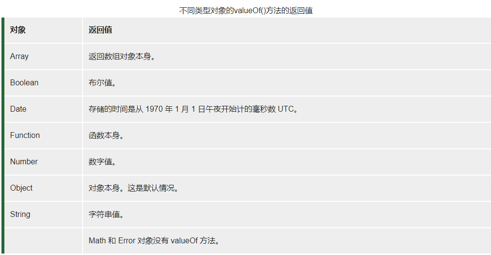

# javaScript的数据类型

## 目录
- [基本数据类型](#基本数据类型)
- [引用类型](#引用类型)
- [特殊数据类型](#特殊数据类型)
- [判断数据类型的四种方法](#判断数据类型的四种方法)
- [js类型转换](#js类型转换)
- [隐式类型转换场景](#隐式类型转换场景)

js的数据类型有：Number、String、Boolean、Undefined、Object、Null，ES6中新增了Symbol，表示独一无二的值
### <a id="基本数据类型">基本数据类型</a>
* `Number`
* `String`
* `Boolean`
* `Null` 
* `Undefine`

### <a id="引用类型">Object（引用类型）中包含了哪几种类型？</a>
* `Data` - 数组
* `Object` - 对象
* `RegExp` - 正则

### <a id="特殊数据类型">特殊数据类型</a>
* `Null` - 它表示一个空对象引用（指针），而typeof操作符检测null会返回一个Object    
    * `typeof null` 会输出Object，这是因为js在最初版本是使用32位系统，不同的对象在底层都是二进制存储,js中二进制前三位为0的话会被判断为object类型，而null的二进制都是0，造成误判。
* `Undefine` - 在使用var声明变量但没有对其初始化时。这个变量的值就是undefined
* `NaN` - 数字运算无法得到的数字时，就会返回NaN
    * 不代表任何值，甚至连自己都不等于自己
    * 任何数据与它运算都会返回NaN
    * isNaN() 用来判断是不是非数字，返回布尔值

### <a id="判断数据类型的四种方法">判断数据类型的四种方法</a>
* typeof 可以对基本类型（包括function）做出准确的判断，但对于引用类型返回都是Object
```javascript
    typeof ""  //string
    typeof 1   //number
    typeof false //boolean
    typeof undefined //undefined
    typeof Symbol() //symbol
    typeof function(){} //function
    typeof {} //object
    typeof null //object
    typeof [] //object
    typeof new Date(); //object
    typeof new RegExp(); //object
``` 
 
* instanceof 运算符是用来判断一个构造函数的prototype属性所指向的对象是否存在另外一个要检测对象的原型链上
```javascript
    function Foo() {}
    function Bar() {}
    Bar.propertype = new Foo()
    new Bar() instanceof Bar // true
    new Bar() instanceof Foo // true
    // 如果仅仅设置 Bar.prototype 为函数 Foo 本身，而不是 Foo 构造函数的一个实例
    Bar.prototype = Foo;
    new Bar() instanceof Foo; // false
```

* constructor 查看对象对应的构造函数
   > 构造函数名.prototype.constructor = 构造函数名
```javascript
    'hello'.constructor == String //true
    true.constructor == Boolean //true
    new Number(1).constructor == Number //true
    // null.constructor == Object //报错
    // undefined.constructor == Object //报错
    new Date().constructor == Date //true
    new Object().constructor == Object //true
    new Array().constructor == Array //true
    new RegExp(/a/).constructor == RegExp //true
    new Function().constructor ==Function //true
    new Error().constructor == Error //true
    document.constructor === HTMLDocument //true
    window.constructor === Window // true
```

* Object.prototype.toString(可以说判断最准确) 对于Object对象，直接调用toString()就能返回[object Object],而对于其他对象，则需要通过call、apply来调用才能返回正确的类型信息
 > `Object.prototype.toString.call()`
```javascript
    Object.prototype.toString.call('') //[object String]
    Object.prototype.toString.call(true) //[object Boolean]
    Object.prototype.toString.call(1) //[object Number]
    Object.prototype.toString.call(null) //[object Null]
    Object.prototype.toString.call(undefined) //[object Undefined]
    Object.prototype.toString.call({}) //[object Object]
    Object.prototype.toString.call([]) //[object Array]
    Object.prototype.toString.call(Symbol()) //[object Symbol]
    Object.prototype.toString.call(Function()) //[object Function] 
    Object.prototype.toString.call(new Date()) //[object Date]
    Object.prototype.toString.call(new RegExp()) //[object RegExp]
    Object.prototype.toString.call(new Error()) //[object Error]
```

接下来我们分析一下四种方法各自的优缺点
<br>



### <a id="js类型转换">js类型转换</a>
#### Boolean()将其他数据类型转成布尔值
0、-0、空字符串""、null、undefined、NaN、false、document.all()这8个转布尔值为false，其他的都为true。
```javascript
    Boolean(0)    // false
    Boolean(-0)    // false
    Boolean('')    // false
    Boolean(null)    // false
    Boolean(undefined)    // false
    Boolean(NaN)    // false
    Boolean(document.all())    // false
    Boolean(' ')    // true
    Boolean('-1')    // true
    Boolean([])    // true
    Boolean({})    // true
    Boolean(function(){})    // true
    Boolean(Symbol())    // true
```
#### Number()将其他数据类型转成数值
* null转为0
* undefined转为NaN
* true转为1，false转为0
* 引用类型先转成字符串然后再转成数值
* 字符串必须是数字字符串才能成功转成相应的数值，否则都为NaN。空字符串以及只有空格的字符串转为0

```javascript
    Number(null)    // 0
    Number(undefined)    // NaN
    Number(true)    // 1
    Number(false)    // 0
    Number('')    // 0
    Number('   ')    // 0
    Number([1])    // 1 [1].toString()返回'1'
    Number([1,2])    // NaN [1,2].toString()返回'1,2'，转数值为NaN
    Number({})    // NaN ({}).toString()返回'[object Object]'，转数值为NaN
```
- 注：事实上引用类型转数值的过程中会自动调用对象的 valueOf() 和 toString()。
    * 先调用 valueOf()，返回值是基本类型的话，即可转数值。
    * 如果 valueOf() 的返回值不可直接转数值的话，再自动调用对象的toString()，然后再将得到的字符串转数值。

```javascript
const obj = {
    valueOf(){
        console.log('valueOf方法被调用了')
        return '666'
    },
    toString(){
        console.log('toString方法被调用了')
        return '2333'
    }
}
Number(obj)
// valueOf方法被调用了
// 666

const obj = {
    valueOf(){
        console.log('valueOf方法被调用了')
        return {};
    },
    toString(){
        console.log('toString方法被调用了')
        return '2333'
    }
}
Number(obj)
// valueOf方法被调用了
// toString方法被调用了
// 2333
```
#### valueOf() 返回对象的原始值


#### String()将其他数据类型转成字符串

String() 和 toString() 效果基本相同，唯一区别就是toString()无法转换null和undefined

```javascript
var a
var b = null
a.toString()    //Uncaught TypeError: Cannot read property 'toString' of undefined
b.toString()    //Uncaught TypeError: Cannot read property 'toString' of null
String(a)   //"undefined"
String(b)   //"null"
```
- 注：引用类型隐形转换字符串时还是遵循先 valueOf() 再 toString()，而不是直接 String()

```javascript
const obj = {
    valueOf(){
        console.log('valueOf方法被调用了')
        return '666'
    },
    toString(){
        console.log('toString方法被调用了')
        return '2333'
    }
}
'00-' + obj    
// valueOf方法被调用了
// '00-666'
'00-' + String(obj)    
// toString方法被调用了
// '00-2333'
```

### <a id="隐式类型转换场景">隐式类型转换场景</a>
#### + （字符串连接符/算术运算符）
* +两边有一边是字符串的话，此时+为字符串连接符，其他情况则为算术运算符。
    * 字符串连接符：将其他数据类型转成字符串，然后进行拼接。
    * 算术运算符：将其他数据类型用Number()转成数字，然后做加法运算。
```javascript
1 + '-haha'    // '1-haha'
1 + true    // 2  Number(true)为1
1 + null    // 1  Number(null)为0
1 + undefined    // NaN  Number(undefined)为NaN
1 + {}    // '1[object Object]'  {}转数字的过程中先转成了字符串，然后就变成了字符串拼接
1 + [1,2,3]    // '11,2,3'  原因同上
[] + {}    // '[object Object]'  原因同上
{} + []    // 0  大括号{}在前面被认为是代码块，所以相当于是 +[]
```

#### `>、<、>=、<=` （关系运算符）

* `>、<、>=、<= `的两边都是字符串的话，比较的是字符的Unicode编码。
* 其他数据类型转成number数字类型来进行比较，但有些具体情况比较特殊。

```javascript
// 一般情况下 Number('2') > 10  false
'2' > 10    // false

// 两边都是字符串 '2'.charCodeAt() > '10'.charCodeAt()  true
'2' > '10'    // true

// 多个字符依次比较 'a'.charCodeAt() > 'b'.charCodeAt  false
'aac' > 'abc'    // false
```

#### ==（关系运算符）
* 类型相同，不发生类型转换。如果都是引用类型，则比较的是引用地址
* 类型不同，则转成number数字类型再进行比较
* NaN不与任何值相等，包括NaN自己
```javascript
    [1] == [1]    // false
    {} == {}    // false
    9 == [9]    // true
    NaN == NaN    // false
```

* 特殊情况：如果数据类型是 null 和 undefined ，结果固定，无规则。
```javascript
    null == null    // true
    undefined == undefined    // true
    undefined == null    // true
```

####  <a id="逻辑非">!（逻辑非）</a>
* 逻辑非，将其他数据类型转成布尔值
* 逻辑非！优先级高于关系运算符

```javascript
// 先算逻辑非，Boolean([])为true => ![]为false => Number(false)为0
![] == 0    // true
// 先算逻辑非，![]为false => Number(false)为0，[].toString()为'' => Number('')为0
[] == ![]    // true
// 先算逻辑非，({}).toString()为'[object Object]' => Boolean('[object Object]') => !{}为false，Number('[object Object]')为NaN
{} == !{}    // false
```


