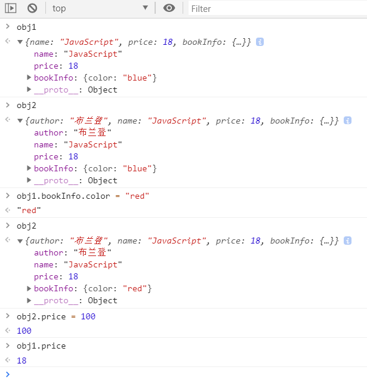
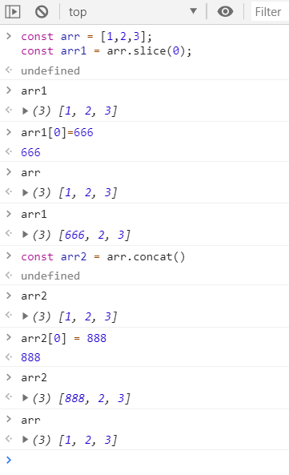
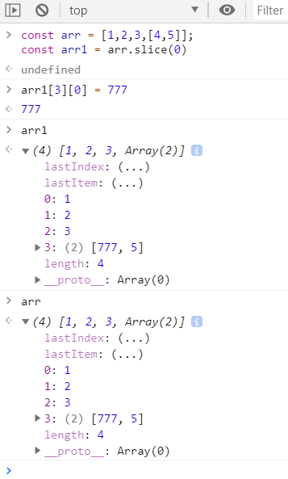
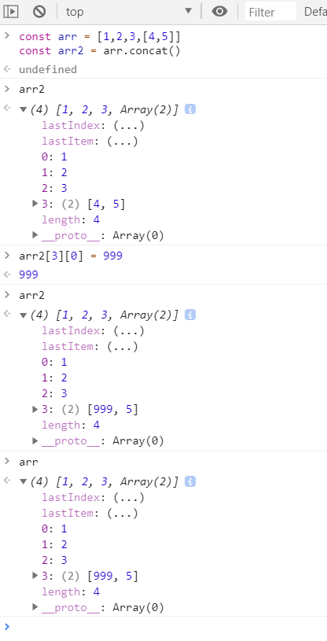

# js的深浅拷贝

ECMAScript中数据类型可分为基本类型和引用类型
- 基本类型：基本类型值在内存中占据固定大小，保存在栈内存中
- 引用类型：引用类型的值是对象，保存在堆内存中，而栈内存存储的是对象的变量标识符以及对象在堆内存中的存储地址

### 不同类型的复制方式
### 基本类型
- 从一个变量向另外一个新变量复制基本类型的值，会创建这个值的一个副本，并将该副本复制给新变量
```javascript
let foo = 1;
let bar = foo;
console.log(foo === bar); // -> true

// 修改foo变量的值并不会影响bar变量的值
foo = 233;
console.log(foo); // -> 233
console.log(bar); // -> 1
```

### 引用类型
- 从一个变量向另一个新变量复制引用类型的值，其实复制的是指针，最终两个变量都指向同一个对象
```javascript
let foo = {
  name: 'Tom',
  age: 18
}
let bar = foo
console.log(foo === bar)

// 改变foo变量的值会影响bar变量的值
foo.age = 20
console.log(foo) // {name: 'Tom', age: 20}
console.log(bar) // {name: 'Tom', age: 20}
```
* 复制复杂对象

```javascript
const obj1 = {
  name: 'JavaScript',
  price: 18,
  bookInfo: {
    color: 'blue'
  }
}
const obj2 = {
  author: '布兰登'
}
function extend(left = {}, right = {}) {
  for (let i in left) {
    right[i] = left[i]
  }
}
extend(obj1, obj2)
```



## 深拷贝&浅拷贝
* 浅拷贝：仅仅是复制了引用，彼此之前操作会互相影响
* 深拷贝：在堆中重新分配内存，不同的地址，相同的值，互不影响

### 浅拷贝的几种方法
* `for...in`
```javascript
const obj1 = {
  name: 'JavaScript',
  price: 18,
  bookInfo: {
    color: 'blue'
  }
}
const obj2 = {
  author: '布兰登'
}

function extend(left = {}, right = {}) {
  for (let i in left) {
    right[i] = left[i]
  }
}
extend(obj1, obj2)
```
* `Object.assign()`
```javascript
const obj1 = {
  name: 'JavaScript',
  price: 18,
  bookInfo: {
    color: 'blue'
  }
}
const obj2 = Object.assign({}, obj1)
```

* 运算扩展符`...`
    * 对于简单对象和数组就是深复制，但是对于复杂对象或者是数组就是浅复制
```javascript
// 对象拷贝
const obj1 = {
  name: 'JavaScript',
  price: 18,
  bookInfo: {
    color: 'blue'
  }
}
const obj2 = {...obj1}
// 数组拷贝
const arr = [1,2,3,[4,5]]
const arr2 = [...arr]
```

#### 数组浅拷贝
- 一维数组
```javascript
const arr = [1,2,3];
const arr1 = arr.slice(0);
const arr2 = arr.concat();
```

- 二维数组

```javascript
const arr = [1,2,3,[4,5]];
const arr1 = arr.slice(0);
const arr2 = arr.concat();
```





注意：从上面图可以看出，slice和concat这两个方法，仅适用于对不包含引用对象的一维数组的深拷贝

### 深拷贝
* 序列化反序列化 `JSON.parse(JSON.stringify())`

```javascript
const obj1 = {
  name: 'JavaScript',
  price: 18,
  bookInfo: {
    color: 'blue'
  }
}
const obj2 = JSON.parse(JSON.stringify(obj1));
```

* 递归
动手实现深拷贝 利【递归】来实现对象或数组的深拷贝。递归思路：对属性中所有引用类型的值进行遍历，直到是基本类型值为止。

```javascript
function deepClone (data) {
    const type = Object.prototype.toString.call(data)
    let obj = null
    if (type === '[object Array]') {
      obj = []
      data.forEach(item => {
        obj.push(this.deepClone(item))
      })
    } else if (type === '[object Object]') {
      obj = {}
      Object.keys(data).forEach(key => {
        if (data.hasOwnProperty(key)) {
          obj[key] = this.deepClone(data[key])
        }
      })
    } else {
      return data
    }
    return obj
  }
```


