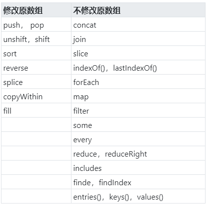

# 数组方法
* push() - 往数组尾部添加一个或多个元素，返回数组新的长度 
* pop - 删除数组最后一个元素，返回删除的元素
* unshift - 往数组开头添加一个或多个元素，返回数组新的长度
* shift - 删除数组第一个元素，返回删除的元素
* sort() - 将数组中的元素排序，并返回排序后的数组，默认以字符串的排列方式（转换成ASCII码进行对比）
```javascript
const arr = new  Array("banana","cherry","apple", undefined)
arr.sort() // ["banana", "cherry", "apple", undefined]
```
* reverse() - 将数组中的元素颠倒顺序，返回逆序后的数组
* slice(start[,end]) - 返回数组的片段或子数组，从start开始到end(不包括end所对应的元素)，如果省略end参数，则截取到数组的最后一项
```javascript
const arr = [1,2,3,4,5]
console.log(arr.slice(0,3)) //返回[1,2,3]     
console.log(arr.slice(3))     //返回[4,5]  
console.log(arr.slice(1,-1))   //返回[2,3,4]    
console.log(arr.slice(-3,-2))//返回[3]
```
* splice(start,deleteNum,…items) - 在数组中插入、删除、替换的通用方法
    * start - 起始索引位置
    * deleteNum - 要删除的数量
    * items - 插入的元素（可以是多个）
```javascript
const arr = [1,2,3,4,5]
// 删除
arr.splice(4,1) // 返回[1,2,3,4]
// 插入
const b = arr.splice(2,0,'a','b') //返回[]，b是[1,2,'a','b',3,4]
// 替换
const c = arr.splice(2,2,[1,2],3) //返回['a','b']; c是[1,2,[1,2],3,3,4]
```
* join(separator) - 返回字符串值，其中包含了连接到一起的数组的所有元素
    * separator - 为分隔符，默认为逗号
    * Array.join()方法是String.split()方法的逆向操作，后者是将字符串分割一个数组。
```javascript
[1,2,3,4].join(',') // 1,2,3,4
```
* concat() - 返回一个新数组，这个新数组是由调用这个方法的数组和参数组成，参数可以是多个
```javascript
const arr = [1,2,3]
console.log(arr.concat(4,5))  //返回[1,2,3,4,5]
arr.concat([4,5]) //返回[1,2,3,4,5]
arr.concat([4,5],[6,7]) //返回[1,2,3,4,5,6,7]
arr.concat(4,[5,[6,7]])//返回[1,2,3,4,5，[6,7]]   
```

* toString()
```javascript
[1,2,3].toString() //生成1,2,3 
["a","b","c"].toString()//生成a,b,c
[1,[2,'c']].toString() //生成1,2,c
```
注意: 这里与不使用任何参数调用join()方法返回的字符串是一样的。
* toLocaleString()
    * toLocaleString()是toString()方法的本地化版本。它调用元素中toLocaleString()方法将每个数组元素转化为字符串，并且使用本地化（和自定义实现的）分隔符将这些字符串连接起来生成最终的字符串。

* Array.isArray() - 判断是否为数组
* indexOf(searchElement[, fromIndex]) - 返回整数索引值，如果没有匹配（严格匹配），返回-1。
    * fromIndex可选，表示从这个位置开始搜索，若缺省或格式不合要求，使用默认值0。
```javascript
const arr = [2, 5, 7, 3, 5];

console.log(arr.indexOf(5, "x")); // 1 ("x"被忽略)
console.log(arr.indexOf(5, "3")); // 4 (从3号位开始搜索)
```
* lastIndexOf(searchElement[, fromIndex]) - 从字符串的末尾开始查找，而不是从开头。
    * fromIndex的默认值是array.length - 1。
```javascript
const arr = [2, 5, 7, 3, 5];
console.log(arr.lastIndexOf(5)); // 4
console.log(arr.lastIndexOf(5, 3)); // 1 (从后往前，索引值小于3的开始搜索)
console.log(arr.lastIndexOf(4)); // -1 (未找到)
```
两个方法在比较第一个参数与数组中的每一项时，会使用全等操作符， 要求必须完全相等,否则返回-1。

### ES6数组方法
- Array.from() 
    * 用于将两类对象转为真正的数组：类似数组的对象（array-like object）和可遍历（iterable）的对象（包括 ES6 新增的数据结构 Set 和 Map）
```javascript
let arrayLike = {
    '0': 'a',
    '1': 'b',
    '2': 'c',
    length: 3
}
let arr2 = Array.from(arrayLike); // ['a', 'b', 'c']
```
    * Array.from还可以接受第二个参数，作用类似于数组的map方法，用来对每个元素进行处理，将处理后的值放入返回的数组。
```javascript
Array.from(arrayLike, x => x * x);
// 等同于
Array.from(arrayLike).map(x => x * x);

Array.from([1, 2, 3], (x) => x * x)// [1, 4, 9]
```
- Array.of() 用于将一组值，转换为数组。
`Array.of(3,4,5,6) // [3, 4, 5, 6]`

- Array.includes() 返回一个布尔值，表示某个数组是否包含给定的值


- entries()，keys() 和 values()
ES6提供了三个新方法：entries()、keys()和values()，用来遍历数组。它们都返回一个遍历器对象，可以用for...of循环进行遍历，唯一的区别是keys()是对数组的键名的遍历、values()是对数组键值的遍历，entries()方法是对数值的键值对的遍历。
```javascript
for (let index of ['a', 'b'].keys()) {
  console.log(index);
}
// 0
// 1

for (let elem of ['a', 'b'].values()) {
  console.log(elem);
}
// 'a'
// 'b'

for (let [index, elem] of ['a', 'b'].entries()) {
  console.log(index, elem);
}
// 0 "a"
// 1 "b"
```




