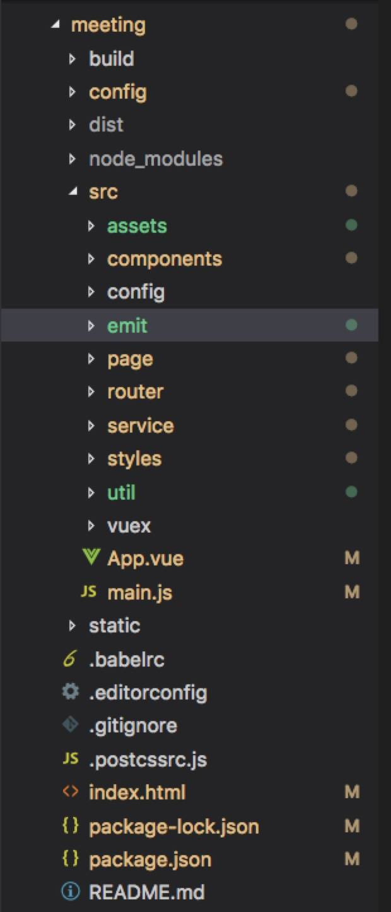
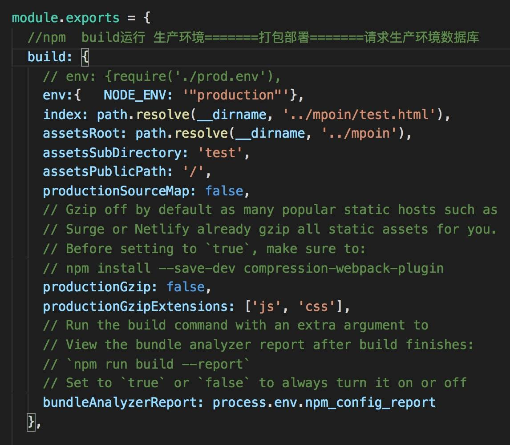
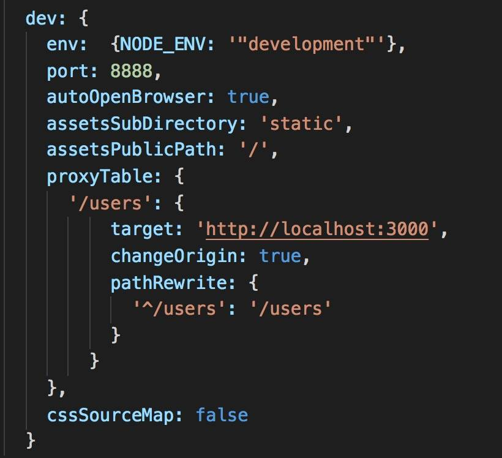

## 二、vue-cli 工程技术集合介绍

### 问题一：请说出vue-cli工程中每个文件夹和文件的用处

#### vue-cli 的目录结构

#### vue-cli目录解析
1.build文件夹：用于存放webpack相关配置和脚本。开发中会使用到此文件夹下webpack.base.conf.js用来配置less、sass等预编译库
2.config文件夹：主要存放配置文件，用于区分开发环境，线上环境的不同。常用到此文件下的config.js配置开发环境的端口号，是否开启热加载，或者设置生产环境的静态资源相对路径。是否开启gzip压缩，npm run build命令打包生成静态资源的名称和路径等
3.dist文件夹：默认npm run build命令打包生成静态资源文件，用于生产部署
4.node_module存放npm命令下载的开发环境和生产环境的依赖包
5.src：存放项目源码及需要引用的资源文件
6.src下assets：存放项目中需要用到的资源文件，css、js、images等
7.src下component：存放vue开发中一些公用组件header.vue、footer.vue等
8.src下emit：自己配置的vue集中式事件管理机制
9.src下router：vue-router路由配置文件
10.src下service自己配置的vue请求后台接口的方法
11.src下page：存放vue页面组件的文件夹
12.src下util：存放vue开发中的一些公用的方法
13.src下vuex：状态管理器
14.src下app.vue 使用标签<router-view/>渲染整个工程的.vue组件
15.src下main.js：vue-cli工程入口文件
16.index.html：根页面，提供

 用于挂载vue节点
17.package.json: 用于node_modules资源部和启动、打包项目的npm命令管理

### 问题二：config文件夹下的index.js对于工程开发环境和生产环境的配置

build 对象下 对于 生产环境 的配置：
* index: 配置打包后的入口.html文件名称以及文件夹名称
* assetsRoot: 配置打包后生成的文件名称和路径
* assetsPublicPath: 配置打包后.html引用静态资源路径，一般要设置成'./'
* productionGzip:是否开放gzip压缩，提升加载速度

dev 对象下 对于 开发环境 的配置：
* port：设置端口号
* autoOpenBrowser: 启动工程时，自动打开浏览器
* proxyTable： vue设置代理，用以解决跨域问题

### 问题三：请你详细介绍package.json里面的配置
* script：npm run xxx命令调用node执行的.js文件
* dependencies：生产环境依赖包的名称和版本号，即这些 依赖包 都会打包进 生产环境的JS文件里面
* devDependencies：开发环境依赖包的名称和版本号，即这些 依赖包 只用于 代码开发 的时候，不会打包进 生产环境js文件 里面。

